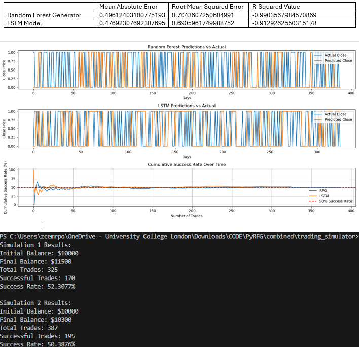

## About Me

I am a highly self-motivated Mechanical Engineering MEng student at University College London (26' grad), based in London, England. My interests span across finance, consulting, software engineering, data science and machine learning and AI. Please find below a couple of open-source projects I have worked on during various internships and personal endeavors.

- 📧 chandernoah@gmail.com
- 💼 [LinkedIn](https://www.linkedin.com/in/noah-chander-014b52250/)
- 🐙 [GitHub](https://github.com/Giterally)

## Coding Skills

SQL, Power BI, Excel: IB Fundamentals and M&A financial modelling masterclasses. Python: Analysing Financial Data & Portfolio Optimisation, Data Analysis with Pandas, Nicegui. Machine Learning: Pytorch, Scikit-Learn. MATLAB, JavaScript, HTML, CSS, React, Next.js, C++, UX (UCL Design Hackathon Winner – using Figma). DevOps, Git Bash, VSCode, Spyder.

## Education

- Current: UCL Mechanical Engineering MEng (1st class grade predicted & achieved across 1st and 2nd year), graduate in June 2026
- Past: Hampton School 2022' A-levels: 4xD1 (A\*\*) grades in Maths, Further Maths, Physics, Chemistry. 10xA\* grades at GCSE (language - Spanish)

## Projects

### 1: Comparing the Efficacy of 2 Machine Learning Stock Predictors
In my free time, I've completed Codecademy courses on data analysis with Pandas, analysing financial data with Python and Machine Learning with Python, as well as some stuff with C++, and hence wanted to put my skills to use.

**Description:**
- Developing a stock predictor using Python, comparing the efficacy of the scikit-learn library’s Random Forest Generator to the use of PyTorch for stock price forecasting using a Recurrent Neural Network: LSTM (Long Short-Term Memory).
- Executed quantitative methods such as rolling averages and threshold probabilities, evaluating output based on various error metrics as well as a trading simulator I built using C++.
- Planning integration of pre-trained LLMs from Hugging Face to make real-time predictions on price reactions to news feed.

**Technologies used:**
- Python: Numpy, Pandas, Scikit-Learn, Pytorch
- C++

For more details, please see my github repository:
[View Project](https://github.com/Giterally/ML_Stock_Predictor_NWC)

### 2: Building a Website for a UCL Professor Working in the Disability Space
In the summer of 2024, I interned as a software engineer at UCL in the department Computer Science, building a website interface for a mechanical tool that helps visually-impaired users interpret images through a refreshable braille surface. 

**Description:**
- Developing a website for the UCL Global Disability Innovation Hub to interface a device that produces a refreshable braille surface.
- Employed Next.js (JS/HTML/CSS) for website GUI, with open-source GitHub code and an OpenAI API for image conversion.
- Carried out live trials and testing with potential users and pitching to potential investors to iterate a Figma UX design for the website.
- Implemented a contact page, user authentication and live notifications, alongside worker threads to handle concurrent API requests.

**Technologies used:**
- Next.js, React
- JS, HTML, CSS
- Page navigation, authentication, contact page etc.

For more details, please see my github repository:
[View Project](https://github.com/Giterally/Tactile_Printing_Software_Interface)

### 3: Development of Online, On-demand Digital Tools
During my 2023 spring internship at Digital McKinsey, I met a consultant who went on to build a startup which would act an as online marketplace for digital tools, and I did some work for him in my second year at university, building digital tools alongside other programmers and using open-source code, as well as developing the website itself.

**Description:**
- Developed front-end (using NiceGUI) & adapted back-end Python code to convert open-source code into web applications.
- Collaborated and shared code within a team of 4 software developers on GitHub, following a documented framework to create tools.
- Produced a range of digital tools such as a QR-code generator and a directory-to-html converter.
- Augmented understanding of public software systems and services such as ArcGIS and IndexNow.

**Technologies used:**
- Python: object oriented programming for tool-building and Nicegui for frontend
- Next.js
- Usage tracking & authentication

Please note that I cannot share code since it is proprietary software owned by the startup Nix.
[Live Demo](https://nix.tech/)

## Contact

Feel free to reach out to me at chandernoah@gmail.com or connect with me on [LinkedIn](https://www.linkedin.com/in/noah-chander-014b52250/).
