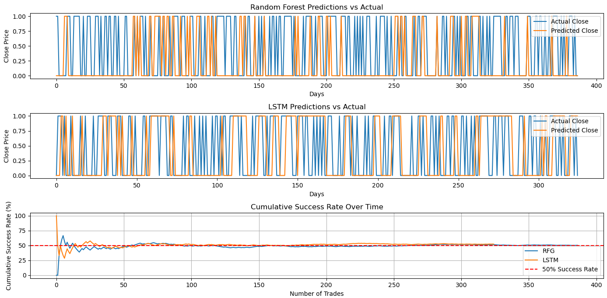

## About
<div style="text-align: center;">
  
</div>


I am a highly self-motivated Mechanical Engineering MEng student at University College London (26' grad), based in London, England. Please find below a couple of open-source projects I have worked on during various internships and personal endeavors.

- 📧 chandernoah@gmail.com
- [LinkedIn](https://www.linkedin.com/in/noah-chander-014b52250/)
- [GitHub](https://github.com/Giterally)

## Coding Skills

SQL, Power BI, Excel: IB Fundamentals and M&A financial modelling masterclasses. Python: Analysing Financial Data & Portfolio Optimisation, Data Analysis with Pandas, Nicegui. Machine Learning: Pytorch, Scikit-Learn. MATLAB, JavaScript, HTML, CSS, React, Next.js, C++, UX (UCL Design Hackathon Winner – using Figma). DevOps, Git Bash, VSCode, Spyder.

## Education

- Current: UCL Mechanical Engineering MEng (1st class grade predicted & achieved across 1st and 2nd year), graduate in June 2026
- Past: Hampton School 2022' A-levels: 4xD1 (A\*\*) grades in Maths, Further Maths, Physics, Chemistry. 10xA\* grades at GCSE (language - Spanish)

## Projects

### 1: Comparing the Efficacy of 2 Machine Learning Stock Predictors
In my free time, I've completed Codecademy courses on data analysis with Pandas, analysing financial data with Python and Machine Learning with Python, as well as some stuff with C++, and hence wanted to put my skills to use.

**Description:**
- Developing a stock predictor using Python, comparing the efficacy of the scikit-learn library’s Random Forest Generator to the use of PyTorch for stock price forecasting using a Recurrent Neural Network: LSTM (Long Short-Term Memory).
- The LSTM beat the RFG across all error metrics, and trading $10,000 over 300+ days it outperformed by approximately 3.81%.
- Executed quantitative and statistical methods such as rolling averages (time-series momentum) and threshold probabilities, evaluating output based on various error metrics as well as a trading simulator I built using C++.
- Planning integration of pre-trained LLMs from Hugging Face to make real-time predictions on price reactions to news feed.


**Technologies used:**
- Python: Numpy, Pandas, Scikit-Learn, Pytorch
- C++


In the image below, some graphical outputs of the model are shown, which were generated by various files on the github repository: [View Project](https://github.com/Giterally/ML_Stock_Predictor_NWC). First, the two models are evaluated based on Mean Absolute Error, Root Mean Squared Error and R-Squared Value, and it can be seen that the LSTM model using Pytorch produces lower error than the Random Forest Generator using Scikit-Learn across all 3 metrics. The two 'Predictions vs Actual' graphs below display the output of the model: a 1 or 0. A 1 is if the market is predicted to go up the next day and a 0 if the market is predicted to go down, since directional prediction is generally more useful in this context than absolute prediction. The final graph shows cumulative success rate over time, and at the bottom we have the results of the C++ trading simulator I built where Simulation 1 is for the LSTM and Simulation 2 for the RFG. Again, the LSTM outperforms.



<div style="text-align: center;">
  
</div>


For more details, please see my github repository:
[View Project](https://github.com/Giterally/ML_Stock_Predictor_NWC)

### 2: Building a Website for a UCL Professor Working in the Disability Space
In the summer of 2024, I interned for 1 month as a software engineer at UCL in the department Computer Science, building a skeleton website interface for a mechanical tool that will help visually-impaired users interpret images through a refreshable braille surface. 

**Description:**
- Developing a website for the UCL Global Disability Innovation Hub to interface a device that produces a refreshable braille surface.
- Employed Next.js (JS/HTML/CSS) for website GUI, with open-source GitHub code and an OpenAI API for image conversion.
- Carried out live trials and testing with potential users and pitching to potential investors to iterate a Figma UX design for the website.
- Implemented a contact page, user authentication and live notifications, alongside worker threads to handle concurrent API requests.

**Technologies used:**
- Next.js, React
- JS, HTML, CSS
- Page navigation, authentication, contact page etc.

I built the website pages, shown in the images below, during my internship and was offered an extension on my contract due to the work I produced but was unable to continue due to other commitments. I do not have access to the completed website but here is the website code I developed on this github repository: [View Project](https://github.com/Giterally/Printing-Software-Website-Interface) (note that the 'Input' page does not yet have functionality)


I also developed this code which  uses the OpenAI DALL-E 3 Model API to generate an image which subsequently goes through a pixelation process to produce an second image that can be interpreted by a mechanical device which projects a heating laser on a metal surface to raise specific nodes configured in such a way that a blind person can run their fingers over the surface to visualise the image.

```python
from openai import OpenAI
import requests
from PIL import Image
from io import BytesIO
import cv2
import numpy as np

# Set your OpenAI API key here
api_key = '---------------------------------------------------------'

# Initialize the OpenAI client
client = OpenAI(api_key=api_key)

# Define the prompt for the image generation
prompt = 'a simple 2D cartoon image of a duck with a clear outline and no background'

# Generate the image using the OpenAI client
response = client.images.generate(
    model="dall-e-3",
    prompt=prompt,
    size="1024x1024",
    n=1,
    quality="standard"
)

# Retrieve the generated image URL
image_url = response.data[0].url
print(f'Generated Image URL: {image_url}')

# Download the image from the URL
def download_image(url, save_path):
    response = requests.get(url)
    if response.status_code == 200:
        image = Image.open(BytesIO(response.content))
        image.save(save_path, 'PNG')
        print(f"Image saved to {save_path}")
    else:
        print(f"Failed to retrieve image. HTTP Status code: {response.status_code}")

save_path = "duck.png"  # Path to save the image
download_image(image_url, save_path)

# Pixelate the downloaded image
def pixelate_image_with_spacing(original_image, grid_size, spacing):
    height, width = original_image.shape[:2]
    rows, cols = grid_size, grid_size
    row_size = height // rows
    col_size = width // cols

    new_height = rows * (row_size + spacing) - spacing
    new_width = cols * (col_size + spacing) - spacing
    pixelated_image = np.ones((new_height, new_width, 3), dtype=np.uint8) * 255

    for i in range(rows):
        for j in range(cols):
            start_row = i * row_size
            start_col = j * col_size
            center_pixel_color = original_image[start_row + row_size // 2, start_col + col_size // 2]
            center_pixel_color = 0 if center_pixel_color < 100 else 255

            new_start_row = i * (row_size + spacing)
            new_start_col = j * (col_size + spacing)
            pixelated_image[new_start_row:new_start_row + row_size, new_start_col:new_start_col + col_size] = center_pixel_color

    return pixelated_image

# Process the image: resize, convert to grayscale, pixelate
def process_image(input_path, output_path, origin_size=(1280, 1280), grid_size=64, spacing=8):
    original_image = cv2.imread(input_path)
    original_image = cv2.resize(original_image, origin_size)
    original_image = cv2.cvtColor(original_image, cv2.COLOR_BGR2GRAY)

    pixelated_image = pixelate_image_with_spacing(original_image, grid_size, spacing)
    cv2.imwrite(output_path, pixelated_image)

# Input and output file paths
input_image = "duck.png"
output_image = "pixelart_with_spacing.png"

# Process the image and save the result
process_image(input_image, output_image, origin_size=(1280, 1280), grid_size=128, spacing=8)
print("Finished.")
```
Which produces the following images:


### 3: Development of Online, On-demand Digital Tools
During my 2023 spring internship at Digital McKinsey, I met a consultant who went on to build a startup which would act an as online marketplace for digital tools, and I did some work for him in my second year at university, building digital tools alongside other programmers and using open-source code, as well as developing the website itself.

**Description:**
- Developed front-end (using NiceGUI) & adapted back-end Python code to convert open-source code into web applications.
- Collaborated and shared code within a team of 4 software developers on GitHub, following a documented framework to create tools.
- Produced a range of digital tools such as a QR-code generator and a directory-to-html converter.
- Augmented understanding of public software systems and services such as ArcGIS and IndexNow.

**Technologies used:**
- Python: object oriented programming for tool-building and Nicegui for frontend
- Next.js
- Usage tracking & authentication

Please note that I cannot share code of tools which are on the website since it is proprietary software owned by the startup Nix. The website is currently still up and can be visited here: [Live Website](https://nix.tech/)


Here is a sample of some code I wrote for a directory-to-HTML converter which is not live on the website since we discovered this particular concept was incompatible with the framework we were using:
```python
# ----- GLOBAL STYLING ----- #

ui.button.default_classes("rounded-md bg-blue-grey-6 px-3 py-2 text-sm font-semibold text-white shadow-sm hover:bg-blue-grey-5 focus-visible:outline focus-visible:outline-2 focus-visible:outline-offset-2 focus-visible:outline-blue-grey-6 w-96")
ui.textarea.default_classes("block rounded-md border-none py-1.5 text-blue-grey-9 shadow-sm placeholder:text-blue-grey-4 focus:ring-2 focus:ring-inset focus:ring-blue-grey-6 sm:text-sm sm:leading-6 w-96")
ui.input.default_classes("block rounded-md border-0 py-1.5 text-blue-grey-9 shadow-sm placeholder:text-blue-grey-4 focus:ring-2 focus:ring-inset focus:ring-blue-grey-6 sm:text-sm sm:leading-6 w-96")
ui.number.default_classes("block rounded-md border-0 py-1.5 text-blue-grey-9 shadow-sm placeholder:text-blue-grey-4 focus:ring-2 focus:ring-inset focus:ring-blue-grey-6 sm:text-sm sm:leading-6 w-96")
ui.label.default_classes("max-w-xl text-base leading-7 text-blue-grey-7 lg:max-w-lg w-96")
ui.image.default_classes("max-w-xl text-base leading-7 text-blue-grey-7 lg:max-w-lg w-96")
ui.html.default_classes("max-w-xl text-base leading-7 text-blue-grey-7 lg:max-w-lg w-96")
ui.markdown.default_classes("max-w-xl text-base leading-7 text-blue-grey-7 lg:max-w-lg w-96")
ui.select.default_classes("mt-2 block rounded-md border-0 py-1.5 pl-3 pr-10 text-blue-grey-9 focus:ring-2 focus:ring-blue-grey-6 sm:text-sm sm:leading-6 w-96")
ui.switch.default_classes("relative inline-flex h-6 w-11 flex-shrink-0 cursor-pointer rounded-full border-2 border-transparent transition-colors duration-200 ease-in-out focus:outline-none focus:ring-2 focus:ring-blue-grey-6 focus:ring-offset-2 w-96")
ui.upload.default_classes("mt-2 block rounded-md border-0 py-1.5 text-blue-grey-9 shadow-sm focus:ring-2 focus:ring-inset focus:ring-blue-grey-6 sm:text-sm sm:leading-6 w-96").default_props("color=blue-grey")
        
# ----- USER INTERFACE ----- #

@ui.page("/") # uid must be passed as a query parameter

def main(request: Request, uid: str):
    tag_run(request, uid)


def generate_html(directory):
        if directory:
            html_path = ""
            file_list = os.listdir(directory)
            html_list = ["<html><head><title>"+os.path.basename(directory)+" - created with Oli's Image Script!</title></head>\n"]
            html_list.append("<body>\n")
            for x in file_list:
                if os.path.isdir(os.path.join(directory, x)):
                    sub_file_list = os.listdir(os.path.join(directory, x))
                    for y in sub_file_list:
                        if (".jpg") in y:
                            if " " in y:
                                os.rename(os.path.join(directory, x, y), os.path.join(directory, x, y.replace(" ", "_")))
                                y = y.replace(" ", "_")
                            html_list.append("" + x + "<br>\n")
            html_list.append("</body></html>")

            html_filename = os.path.basename(directory) + ".htm"
            html_path = os.path.join(directory, html_filename)

            html_file = open(os.path.join(directory, os.path.basename(directory) + ".htm"), "w")
            html_file.writelines(html_list)
            html_file.close()

            ui.label("HTML file generated at", html_path)
            
            # Allow user to export the data

            with ui.row():
                ui.button("Download HTML file",
                        on_click=lambda: ui.download(html_file, filename=html_filename)
                        )

# Create UI
    
ui.label("Upload directory to be converted to HTML.")
directory = ui.upload(label='Select Directory')

ui.separator()

ui.button("Generate HTML file", on_click=lambda: generate_html(directory))
ui.run()
```

## Contact

Feel free to reach out to me at chandernoah@gmail.com or connect with me on [LinkedIn](https://www.linkedin.com/in/noah-chander-014b52250/).
